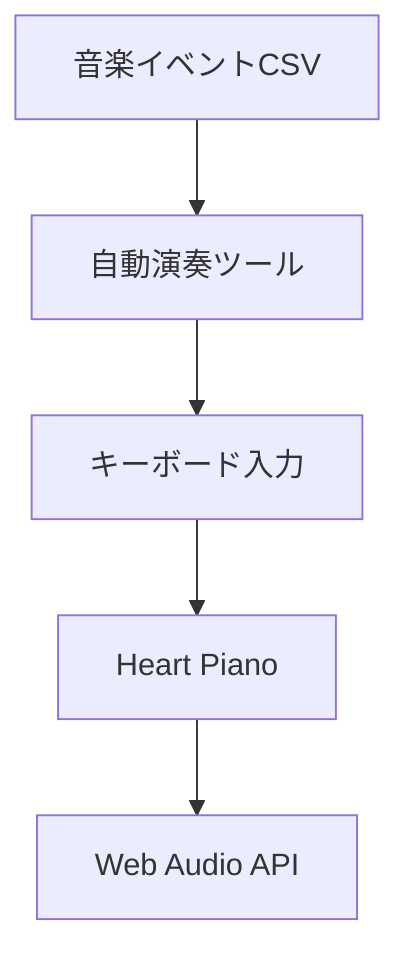

# 💖 Heart Piano & 自動演奏ツール

PCキーボードで演奏できるブラウザピアノと、CSVの音符データから自動演奏を行うAutoHotkeyエンジンを組み合わせたプロジェクトです。

ハートピアノだけをブラウザで手動演奏することも、自動演奏ツールからキー入力を送って自動演奏することもできます。

## ✨ 特徴

### Heart Piano

- ブラウザだけで動作する3オクターブのキーボードピアノ
- 複数キーを使った和音演奏
- 押したキーとピアノ鍵盤の発光表示
- 演奏に連動するハートアニメーション
- Web Audio APIによる音声合成
- コンプレッサーによる音割れの軽減

### 自動演奏ツール

- 音楽イベントを記録したCSVの読み込み
- Romantic、Mechanical、OldTimeyの3演奏スタイル
- メロディ判定、音域調整、ルバート、アーティキュレーション補正
- MIDIノートを物理キーボードのスキャンコードへ変換
- 高精度タイマーによる自動演奏
- 常に手前に表示される進行状況ウィンドウ

## 🎹 デモ

GitHub Pagesを有効にすると、次の形式のURLからハートピアノを開けます。

```text
https://GitHubユーザー名.github.io/heart-piano/
```

公開後、この部分を実際のURLへ書き換えてください。

## 🧩 システム構成



自動演奏ツールは音声を直接生成せず、CSVから作成したキーボード入力を、その時点で選択されているウィンドウへ送信します。Heart Pianoは受け取ったキーに対応する音をブラウザ上で鳴らします。

## 📁 リポジトリ構成

```text
heart-piano/
├── index.html
├── style.css
├── script.js
├── README.md
└── 自動演奏ツール/
    ├── 自動演奏ツール.ahk
    └── README.md
```

| ファイル | 役割 |
| --- | --- |
| `index.html` | Heart Pianoのページ構造 |
| `style.css` | 色、サイズ、配置、発光表現 |
| `script.js` | 鍵盤生成、キー入力、音声合成 |
| `README.md` | Heart Pianoの詳しい仕様とカスタマイズ方法 |
| `自動演奏ツール/自動演奏ツール.ahk` | CSV自動演奏用AutoHotkey v2スクリプト |
| `自動演奏ツール/README.md` | 自動演奏ツールの詳しい仕様、CSV形式、注意事項 |

## 🚀 Heart Pianoを使う

### GitHub Pagesから使う

公開済みのGitHub Pages URLをブラウザで開き、画面に表示されたキーを押します。

ブラウザの音声機能が一時停止されている場合は、ページ内を一度クリックしてからキーを押してください。

### ローカルで使う

1. このリポジトリをダウンロードします。
2. `index.html`、`style.css`、`script.js`を同じフォルダに置きます。
3. `index.html`をダブルクリックします。
4. ブラウザ上で対応するキーを押します。

インストールやビルド作業は必要ありません。

## ⌨️ キー配置

| 音域 | 白鍵 | 黒鍵 |
| --- | --- | --- |
| 高音域 | `Q W E R T Y U I` | `2 3 5 6 7` |
| 中音域 | `Z X C V B N M` | `S D G H J` |
| 低音域 | `, . / O P [ ]` | `L ; 0 - ^` |

キーとMIDIノート番号の完全な対応表は、[Heart Pianoの詳細README](./README.md)を参照してください。

## 🤖 自動演奏ツールで自動演奏する

### 必要なもの

- Windows
- AutoHotkey v2.0
- 自動演奏ツール対応形式のCSVファイル
- キー入力を受け取るHeart Pianoまたは別のアプリ

### 起動手順

1. AutoHotkey v2をインストールします。
2. `自動演奏ツール`フォルダ内の`自動演奏ツール.ahk`ファイルを起動します。
3. 表示された画面で演奏用CSVを選択します。
4. `READY: F1 TO START`と表示されるまで待ちます。
5. Heart Pianoを表示しているブラウザをクリックします。
6. `F1`を押して演奏を開始します。
7. 途中で停止する場合は`Esc`を押します。

CSVの列構成、演奏スタイル、全MIDI対応表については、[自動演奏ツールの詳細README](./自動演奏ツール/README.md)を参照してください。

## 🎼 自動演奏ツールの演奏スタイル

| スタイル | 特徴 |
| --- | --- |
| `Romantic` | ルバートとヒューマナイズを有効にし、音の余韻を少し延長 |
| `Mechanical` | 時間的な揺らぎを無効にした均一な演奏 |
| `OldTimey` | タイミングと内部ベロシティへランダムな揺れを追加 |

初期設定は`Romantic`です。

## ⚠️ 自動演奏時の注意

自動演奏ツールは、演奏開始時に選択されているウィンドウへキー入力を送ります。

テキストエディター、チャット、ゲームなどを選択したまま`F1`を押すと、そのアプリへ大量のキー入力が送られます。必ず先にHeart Pianoを表示しているブラウザをクリックしてください。

また、初期設定ではタイミング精度を優先するため、AutoHotkeyのプロセス優先度が`Realtime`に設定されています。PCが不安定になる場合はスクリプトを終了し、`High`など、より低い優先度への変更を検討してください。

## ℹ️ 現在の仕様と制限

- 自動演奏ツールのサステインイベントはCSVから読み込まれますが、現在の再生処理では未使用です。
- ベロシティは物理キーの打鍵強度へ変換されません。
- 自動演奏ツールの演奏は1回の起動につき1つのCSVです。
- 演奏完了後、自動演奏ツールは自動終了します。
- キーの送信先ウィンドウは固定されていません。
- 現在のHeart Pianoとの組み合わせでは、自動演奏ツール内部のMIDIノートより1オクターブ低い音が鳴ります。

## 🎨 カスタマイズ

### Heart Piano

- タイトル：`index.html`
- 色やサイズ：`style.css`
- 音量、音色、キー配置：`script.js`

### 自動演奏ツール

- ウィンドウタイトル：`AppContext.Config.Title`
- 最大演奏時間：`AppContext.Config.MaxDurationMs`
- GUIカラー：`WindowBg`と`AccentColor`
- 演奏スタイル：`AppContext.Flags.ActiveStyle`

詳しい変更方法は、それぞれの詳細READMEを参照してください。

## 🛠️ 使用技術

- HTML5
- CSS3
- JavaScript
- Web Audio API
- KeyboardEvent API
- AutoHotkey v2
- Windows API
- QueryPerformance Counter
- Windows Multimedia Timer

## 📚 詳細ドキュメント

- [Heart Pianoの詳細README](./README.md)
- [自動演奏ツールの詳細README](./自動演奏ツール/README.md)
